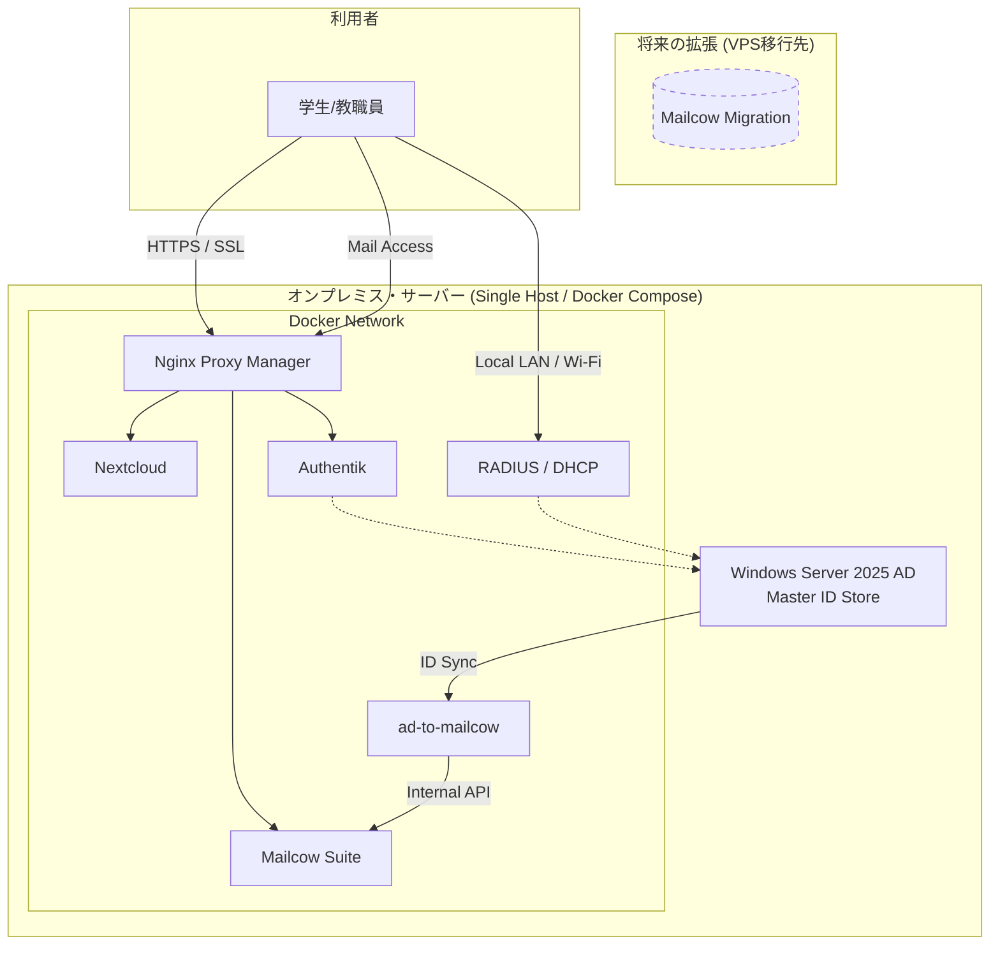

# 数学科インフラ 概念図 (v1.0)

## 1. 全体俯瞰図 (Hybrid Infrastructure)

この図は、学内（オンプレミス）と学外（さくらVPS）の役割分担、およびデータの流れを示しています。

---

## 2. 通信の流れと役割解説

### 2.1 ID同期 (AD ↔ Mailcow)
- **起点**: Windows Server 2025 AD (オンプレ)
- **処理**: Python自作スクリプト (`ad-to-mailcow`) が定期的にADの変更（パスワード変更、新規ユーザー、OU移動等）を監視。
- **反映**: Mailcow (VPS) のAPIへRESTで送信し、即座にメールアカウント情報を動機。
- **メリット**: LDAPマネージャーのような複雑なミドルウェアを使わず、透明性の高いコードで管理。

### 2.2 ユーザー認証とSSL (NPM + Authentik)
- **入口**: Nginx Proxy Manager (NPM)。
- **認証**: 全てのWebアプリ（Nextcloudなど）は Authentik を経由し、AD認証 + 二段階認証 (MFA) で強力に保護。
- **証明書**: NPMが Let's Encrypt 等の SSL証明書を自動更新・一括管理。

### 2.3 学科LAN制御 (RADIUS + DHCP)
- **有線/無線**: 物理的なLANコンセントやWi-Fiアクセスポイントからの認証要求を FreeRADIUS が受け、ADの所属グループ等を確認して許可。
- **IP配布**: Kea DHCP が適切なセグメントのIPアドレスを動的に割り当て。

---

## 3. 停電対策 (Business Continuity)

- **可用性の分離**:
    - メール (Mailcow) は学外にあるため、学内停電時でも外部との連絡（緊急連絡等）が可能。
    - 大容量データ (Nextcloud) は学内にあるため、学内LANの高速帯域で研究データをストレスなく扱える。
